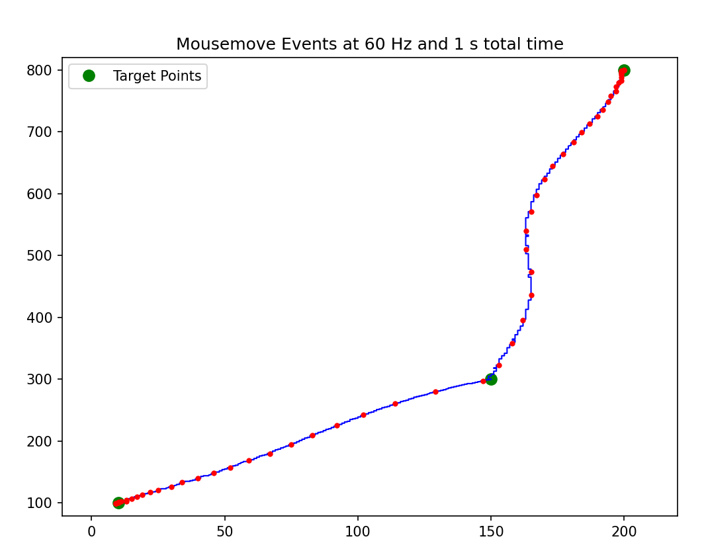
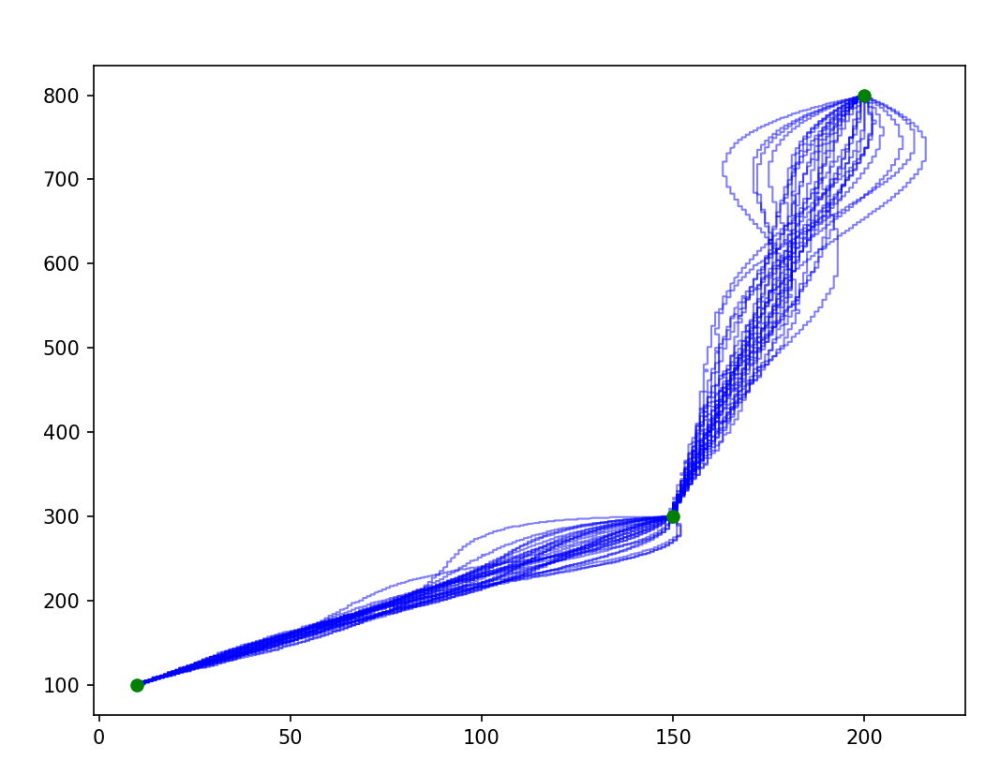
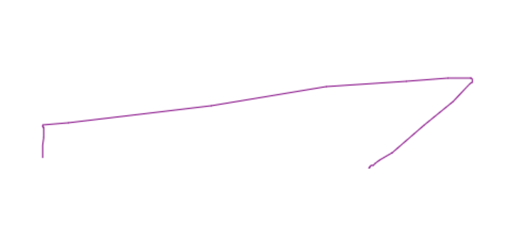
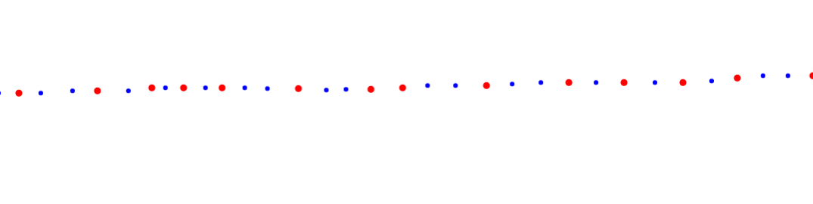
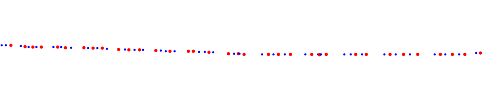

## Page Interactions

### element click
- generated

### mouse path
Note: this is not yet implemented

#### generated example

#### real example
- with [mouse event testing](https://www.vsynctester.com/testing/mouse.html)
- mousepad
- Windows Laptop

=> events of almost exactly 60Hz (screen-frequency)

- with [getCoalescedEvents demo](https://omwnk.csb.app/)
- gets more than 60 events/sec with `getCoalescedEvents` api
- about 2-2.1 Coalesced Event per normal event

=> about. 180 events/sec

- with mousepad

- with mouse

